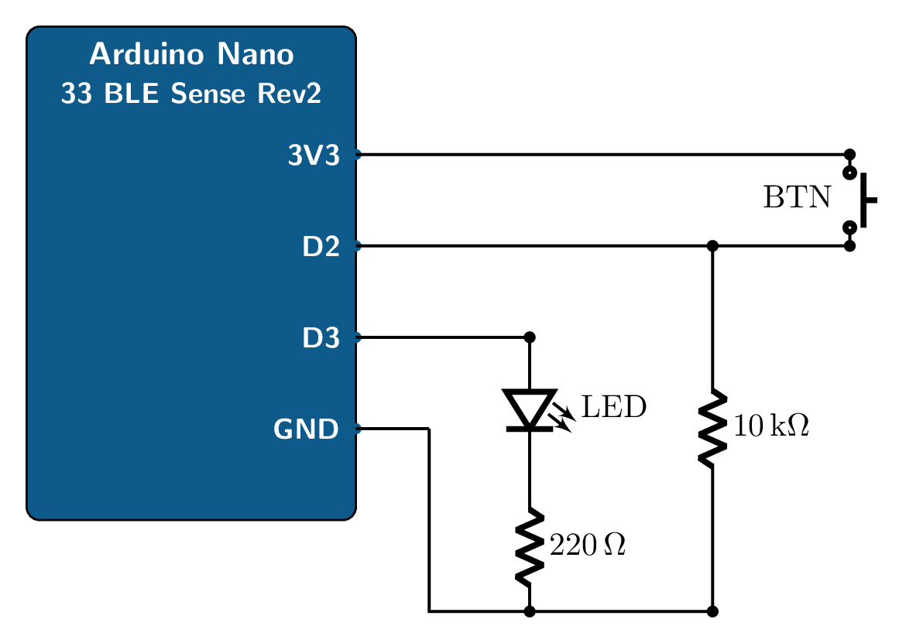

# Lab 1 — Microcontroller Programming + First TFLite Micro Inference

**EECE.4862 / 5862 — Embedded Artificial Intelligence · Summer 2026**

| | |
|---|---|
| **Released** | Monday, May 18, 2026 |
| **Due** | Sunday, June 7, 2026, 11:59 PM ET |
| **Points** | 20 (4862) / 18 (5862) |
| **Anchors** | L1, L2, L4, L5 |
| **Reading** | *TinyML Cookbook* Ch 1, Ch 2 |
| **Late policy** | 4 % per day; 20 % per week |

---

## 1. Objectives

By the end of this lab you will be able to:

1. Install and configure the Arduino IDE (or Arduino CLI) for the
   **Arduino Nano 33 BLE Sense Rev2** (SKU ABX00070), and confirm the
   toolchain by flashing a known-good sketch.
2. Read a digital input (push-button) and drive a digital output (LED)
   on a breadboard, using both **polling** and **interrupt** styles.
3. Use the Serial Monitor to log runtime values from the board.
4. Deploy a pre-trained TensorFlow Lite Micro model — the
   *hello-world* sine-wave model — onto the Nano and verify its
   predictions match the expected sine output.
5. Measure and report **flash usage, RAM usage, and inference latency**
   for the deployed model, and reflect on what those numbers mean for
   the model size you could realistically deploy.

---

## 2. Required hardware and software

### Hardware (from your course lab kit; see `lab-kit-bom.md` on Canvas)

- Arduino Nano 33 BLE Sense Rev2 (SKU **ABX00070**) with headers
- Solderless breadboard (830 tie-points)
- Jumper wires (M-M, M-F)
- 1 × 5 mm LED + 1 × 220 Ω resistor (current-limit) + 1 × 10 kΩ resistor (pull-down)
- 1 × push-button (tactile, breadboard-mountable)
- USB-A to micro-USB **data** cable (not power-only)

### Software (install before starting)

- **Arduino IDE 2.x** — <https://www.arduino.cc/en/software>
  (or **Arduino CLI** if you prefer the terminal)
- **Arduino Mbed OS Nano Boards** package — install via Boards Manager;
  enables the Nano 33 BLE Sense target.
- **Arduino_TensorFlowLite** (TFLite Micro) — install via
  **Sketch → Include Library → Add .ZIP Library…** using
  [`lab-1/Arduino_TensorFlowLite.zip`](Arduino_TensorFlowLite.zip)
  in this repo. The file should be **~1.48 MB**; if your download is
  ~219 KB you grabbed GitHub's HTML preview page by mistake — re-download
  from the *raw* link rather than the blob URL. The library inside is
  v2.4.0-ALPHA (Pete Warden / TensorFlow Authors), mirrored verbatim
  from the *TinyML Cookbook 2E* companion repo so the textbook's example
  sketches compile unchanged. See
  [`Arduino_TensorFlowLite.zip.NOTICE.md`](Arduino_TensorFlowLite.zip.NOTICE.md)
  for source / license / install details.
- **`Arduino_HS300x`** library — install via Library Manager for the
  Rev2 on-board temperature/humidity sensor. Not needed for Lab 1,
  but install it now so you have it for Lab 2.

> **Note for Cookbook Rev1 readers.** The textbook's examples were
> written for the older Nano 33 BLE Sense Rev1, which uses the HTS221
> T/H sensor and the `Arduino_HTS221` library. The Rev2 board ships
> with the HS3003 sensor and the `Arduino_HS300x` library. Wherever the
> textbook says `#include <Arduino_HTS221.h>`, substitute
> `#include <Arduino_HS300x.h>`.

---

## 3. Background

Read Chapter 2 of the *TinyML Cookbook* (2nd Ed., Iodice, Packt 2023)
before starting. Chapter 2 covers the Arduino programming model
(`setup()` / `loop()`), digital I/O, interrupts, and the serial
console — the same material this lab puts into practice.

For the lecture context: Lecture 1 (Introduction to Embedded AI) and
Lecture 2 (ML / DL Fundamentals) on the syllabus give the framing
that motivates *why* we're working at this scale; Lectures 4 and 5
(Embedded Hardware and Software) develop the toolchain details further
during Week 2 and Week 3 of the course.

---

## 4. Part A — Toolchain setup + GPIO (8 points)

### A.1 — Install and verify the toolchain (2 pts)

1. Install the Arduino IDE and the Mbed OS Nano Boards package.
2. Plug the Nano 33 BLE Sense Rev2 into your laptop with the
   **data-capable** USB cable.
3. In the IDE, set Tools → Board → *Arduino Nano 33 BLE*, and Tools →
   Port → the COM/tty port that your Nano enumerates as.
4. Open File → Examples → 01.Basics → **Blink**. Compile and upload it.
5. The on-board orange LED should blink at 1 Hz. **Take a photo.**

**Deliverable for A.1:** photo of the Nano with the blink LED visible,
plus the IDE compiler output showing successful upload.

### A.2 — Serial logging (1 pt)

Start from the skeleton in
[`starter/a2-blink-serial/`](starter/a2-blink-serial/) — it has the
structure and `// TODO(student)` hints; you write the logic.

1. Modify Blink so that, in addition to toggling the LED, it prints a
   short message to the Serial console at every state change
   (e.g. `LED ON @ 1234 ms`). Use `Serial.println()`. Use
   `millis()` for the timestamp.
2. Open Tools → Serial Monitor at 9600 baud. Watch the messages stream.

**Deliverable for A.2:** the modified sketch (`a2-blink-serial.ino`)
and a screenshot of the Serial Monitor.

### A.3 — Push-button (polling) (2 pts)

Wire a push-button between digital pin **D2** and **3V3**, with a 10 kΩ
**pull-down** resistor from D2 to GND. Wire an external LED on **D3**
(with the 220 Ω series resistor to GND). The reference wiring is
shown in Figure 1; Cookbook §2 walks through it step by step.


*Figure 1 — Push-button on D2 with 10 kΩ pull-down resistor to GND,
and external LED on D3 with 220 Ω series resistor to GND.*

Start from the skeleton in
[`starter/a3-button-polling/`](starter/a3-button-polling/) (structure
+ `// TODO(student)` hints). Write a sketch that:

- Reads D2 every loop iteration (polling).
- Toggles the external LED on D3 whenever it detects a *fresh* button
  press (i.e. debounce — don't toggle on every loop iteration while
  the button is held).
- Logs each detected press to Serial with a timestamp.

**Deliverable for A.3:** the sketch (`a3-button-polling.ino`), a photo
of the breadboard wiring, and a serial-monitor screenshot showing at
least five button presses logged.

### A.4 — Push-button (interrupt) (3 pts)

Start from the skeleton in
[`starter/a4-button-interrupt/`](starter/a4-button-interrupt/)
(structure + `// TODO(student)` hints). Rewrite A.3 using an attached
interrupt handler (`attachInterrupt()`) instead of polling. The
interrupt should fire on the *rising* edge of D2 and set a
`volatile bool` flag that the main loop consumes.

Add one Serial line that reports — for each detected press — the
**number of microseconds elapsed in `loop()`** since the previous
button event. Use `micros()`. This number tells you how long the main
loop is willing to wait before noticing an event in the polling style.

**Deliverable for A.4:** the sketch (`a4-button-interrupt.ino`), a
serial screenshot showing the timing report, and a one-paragraph
reflection in your lab report: *what would you lose, and what would
you gain, if you replaced the polling style with the interrupt style
in a battery-powered always-on listening device?*

---

## 5. Part B — TFLite Micro hello-world inference (10 points)

### B.1 — Open and read the hello-world example (1 pt)

In the Arduino IDE, **File → Open…** the
[`starter/hello_world/hello_world.ino`](starter/hello_world/hello_world.ino)
sketch from this repo. The IDE will load all ten files in that folder
into one sketch tab group. This is the canonical TensorFlow Lite Micro
sine-wave demo (Apache-2.0, mirrored from Google's
`tflite-micro-arduino-examples` repo — see
[`starter/hello_world/NOTICE.md`](starter/hello_world/NOTICE.md)). It
ships a pre-trained model that learned the function
$y = \sin(x)$ over the domain $[0, 2\pi]$.

> *Why not the library's built-in Examples menu?* The
> `Arduino_TensorFlowLite` library you installed in §2 contains the
> TFLM **runtime** only — no `examples/` folder, hence no entry under
> **File → Examples → Arduino_TensorFlowLite**. The sketch lives here
> instead.

Read through the sketch top to bottom (it's ~100 lines).
Identify and write a one-sentence comment in your lab report for each
of the following sections of the code:

- The **model array** (the `.tflite` data baked in as a C array).
- The **`AllOcate Tensors`** call.
- The **inference loop** (calls to `Invoke()`).
- The **output post-processing** (reading `interpreter->output(0)`).

### B.2 — Compile, flash, and verify (3 pts)

**Compile.** Click **Verify** (✓). The first build takes 1–2 minutes —
TFLite Micro is a large header-and-source library and the IDE has to
compile it from source on this first run. You should see warnings like:

```
Library Arduino_TensorFlowLite has been declared precompiled:
Precompiled library in ".../src/cortex-m4/fpv4-sp-d16-softfp" not found
Precompiled library in ".../src/cortex-m4" not found
```

**These warnings are expected and harmless.** Iodice's library declares
`precompiled=full` in its `library.properties` but doesn't ship the
pre-built `.a` blobs for Cortex-M4 — the IDE silently falls back to
compiling from source. The first build is slow because of this;
subsequent builds are cached.

A successful compile ends with two lines that look like:

```
Sketch uses ~350,000 bytes (~35%) of program storage space. Maximum is 983040 bytes.
Global variables use ~54,000 bytes (~20%) of dynamic memory, leaving ~208,000 bytes ...
```

Write those exact numbers down — you'll report them in B.3.

**Flash.** Click **Upload** (→). The upload itself is fast (~5–10 s).
After "Done uploading" appears, the Nano resets and starts running
the sketch.

**Verify the outcome.** Three independent indicators that the sketch
is running correctly:

1. **The Nano's orange built-in LED fades sinusoidally** — slowly
   brightening, dimming, fully off, brightening again. One full cycle
   takes ~10 seconds (200 inferences per $2\pi$ cycle at ~50 ms
   each). If the LED is dark or stuck at one brightness, the sketch is
   stuck — check the Serial Monitor for an error.
2. **Serial Monitor (Tools → Serial Monitor)** at **9600 baud** — you
   should see a stream of integers (one per line) that smoothly cycle
   between 0 and 255 and back. These are the brightness values being
   printed by `HandleOutput()`.
3. **Serial Plotter (Tools → Serial Plotter)** at **9600 baud** — same
   data plotted live. You should see a clean sine wave oscillating
   between 0 and 255.

If the Serial Monitor is silent: check the baud rate (must be 9600)
and the selected port (Tools → Port → Arduino Nano 33 BLE). If the
plotter shows a flat line at 255 or 0, the model isn't running —
re-flash and try again.

**What `HandleOutput()` actually does.** The model's output is a
single float $y \approx \sin(x)$ in $[-1, 1]$.
`HandleOutput()` (in
[`arduino_output_handler.cpp`](starter/hello_world/arduino_output_handler.cpp))
linearly maps that to an 8-bit PWM duty cycle with `brightness =
127.5 · (y + 1)`, clamps to `[0, 255]`, and calls
`analogWrite(LED_BUILTIN, brightness)`. That one line is the **act**
stage of the sense → infer → act loop — it's what turns a model
prediction into a physical effect on the board. No external wiring
is needed; pin 13 (the on-board orange LED) supports PWM on the
nRF52840.

**Deliverables for B.2:**

- A screenshot of the Serial Plotter showing one clearly recognizable
  cycle of the sine wave (at least one peak and one trough visible).
  The IDE 2.x plotter's rolling window is too narrow to capture much
  more than that in a single frame — if you want to show more, you may
  attach 2–3 stitched screenshots or a short screen recording instead.
- A one-sentence note in your lab report confirming the Nano's
  built-in LED fades visibly in sync with the plot.

### B.3 — Resource and latency measurements (4 pts)

Start from
[`starter/b3-hello-world-instrumented/`](starter/b3-hello-world-instrumented/)
— it's a copy of the working hello_world sketch with two
`// TODO(student) B.3:` blocks marking where the timing code goes.
Build and flash it unmodified first to confirm it runs, then add
instrumentation to report:

- **Flash usage** and **RAM usage** — from the Arduino IDE's compile
  output (it prints both after a successful compile).
- **Inference latency** — wrap each `Invoke()` call with `micros()`
  before and after; print the elapsed microseconds for at least 100
  successive inferences and report the **min, mean, and max** in your
  lab report.

> **Print the latency line with `Serial.print()` / `Serial.println()`,
> not `MicroPrintf`.** The TFLM v2.4.0-ALPHA `MicroPrintf` bundled with
> this lab does not accept the `l` length modifier, so `%lu` for the
> `unsigned long` that `micros()` returns prints garbage. `Serial`
> handles `unsigned long` natively. (If you really want to keep
> `MicroPrintf`, cast each value to `unsigned int` and use `%u` — `int`
> and `long` are both 32 bits on the nRF52840, so no precision is
> lost.)

> **`micros()` resolution caveat.** On the nRF52840 the underlying
> microsecond timer has roughly **4 µs** granularity. A single
> `Invoke()` that takes only a handful of microseconds will quantize
> visibly — the **mean over 100 inferences** is the meaningful number;
> the **min** may collapse to the same value across many samples.
> Report your numbers in that light.

**Deliverable for B.3:** a small table in your lab report with
the four numbers (flash, RAM, latency min/mean/max). A serial log of
your latency measurements.

### B.4 — Reflection (2 pts)

Two short paragraphs (3–5 sentences each) in your lab report:

- The hello-world model is tiny (~3 KB). Given your measured flash and
  RAM consumption, roughly what fraction of the Nano's 1 MB flash and
  256 KB SRAM is the model + TFLite Micro runtime using? Could you
  realistically fit a model that is 10×, 50×, or 100× larger?
- The hello-world model is a *regression* model. Describe one
  embedded AI application from Lecture 1 (or one you came up with for
  Forum 1) that would also be a regression problem, and one that
  would be a classification problem.

---

## 6. Part C — 5862-only deepening (4 points)

**5862 students must complete one** of the three options below. 4862
students may attempt one for bonus credit (up to +2 pts toward the
final lab grade, capped at 20).

### Option C.1 — Polling vs. interrupt latency characterization

Quantitatively compare your A.3 (polling) and A.4 (interrupt) sketches.
Trigger 50 button presses at varying main-loop workloads (insert a
`delay(1)` / `delay(10)` / `delay(50)` in the main loop). For each
workload, report the worst-case response time from press to LED toggle.
Two short paragraphs of analysis: what is the relationship between
main-loop workload and the worst-case response time in each style?

### Option C.2 — IMU-driven LED blink rate

Use the on-board BMI270 IMU (`Arduino_BMI270_BMM150` library) to read
the magnitude of the accelerometer vector each loop iteration. Map
that magnitude to an LED blink rate (slower when the board is still,
faster when it is moving). Include a short serial log of the
acceleration magnitudes and corresponding blink intervals.

### Option C.3 — Latency under three optimization levels

Re-compile the B.3 instrumented hello-world sketch under three
optimization settings — `-O0`, `-O2`, `-O3` — and report mean
inference latency (over 100 invocations) and final flash size for
each. Two short paragraphs of analysis: at what cost does each
optimization level come, and what would change at runtime?

The Arduino IDE doesn't expose the gcc optimization level in any
menu. The supported override path is a **`platform.local.txt`** file
placed next to the Mbed Nano core's `platform.txt`. Concrete steps:

**1. Locate the Mbed Nano core directory.** This is the folder
containing `platform.txt` for the board you're building against.
Replace `<version>` with whatever version you have installed (e.g.
`4.2.4`):

| OS | Path |
|---|---|
| macOS | `~/Library/Arduino15/packages/arduino/hardware/mbed_nano/<version>/` |
| Linux | `~/.arduino15/packages/arduino/hardware/mbed_nano/<version>/` |
| Windows | `%LOCALAPPDATA%\Arduino15\packages\arduino\hardware\mbed_nano\<version>\` |

You should see `platform.txt`, `boards.txt`, and a `variants/`
folder in that directory. Do **not** edit `platform.txt` — the IDE
will overwrite it on the next core update.

**2. Create `platform.local.txt`** in that same directory with this
single line:

```
compiler.optimization_flags=-O3
```

**3. Fully quit and relaunch the Arduino IDE** (the IDE caches
`platform.txt` at startup). Then verify the override took effect:
turn on **File → Preferences → "Show verbose output during: compile"**,
hit **Verify**, and confirm you see `-O3` in the gcc command lines
scrolling by. The Mbed core's default is `-Os`, so the change is
visible.

**4. Record one data point.** Flash the sketch, capture mean latency
over 100 inferences and the flash size the IDE reports. Write them
down.

**5. Repeat for `-O2` and `-O0`** by editing the one line in
`platform.local.txt` (no restart needed between changes after the
first — the IDE re-reads `platform.local.txt` on each build). Tabulate
the three (latency, flash) pairs.

**Sanity check:** all three numbers should differ from the IDE's
default `-Os` build, and from each other. If two levels give you
identical flash and latency, the override didn't take effect — recheck
the file path and the verbose compile output.

*(Alternative: if you're using the Arduino CLI rather than the IDE,
pass `--build-property "compiler.optimization_flags=-O3"` on the
command line instead. The IDE path above is the recommended route for
this lab.)*

---

## 7. Deliverables and submission

> **About the `starter/` skeletons.** The A.2–A.4 and B.3 starters are
> *scaffolding* — file structure plus `// TODO(student)` hints, with
> the graded logic left for you to write. They compile and upload
> as-is so you can confirm your toolchain, but a starter submitted
> with its TODOs unfilled earns no credit for that part. Credit comes
> from your working implementation. (`starter/hello_world/` is the one
> exception — it is a complete sketch you simply run for B.1/B.2.)

Submit a **single PDF** lab report following the
[lab report template](../templates/lab-report-template.docx) (also
posted on Canvas). The report should contain:

- Title page (your name, lab title, section, date).
- **Objectives** — restate in your own words.
- **Setup** — photos of your breadboard wiring (A.3, A.4); a screenshot
  of the IDE confirming the board and port were detected.
- **Method and results** — one section for each of A.1–A.4, B.1–B.4,
  and (5862) Part C. Include code listings (you may screenshot key
  snippets; do not paste 1000-line dumps). Include the screenshots
  and serial logs called out as deliverables above.
- **Analysis** — your reflection paragraphs from A.4, B.4, and
  Part C if applicable.
- **AI tool disclosure** — per the syllabus AI Use Policy, declare
  whether you used any AI tool, and if so, list the tool, the prompts,
  the output, and the modifications you made.
- **References** — at minimum cite the *TinyML Cookbook* and the
  Arduino documentation pages you used.

Also include in your Canvas submission, alongside the PDF:

- A `.zip` of all your Arduino sketches from this lab
  (`a2-blink-serial/`, `a3-button-polling/`, `a4-button-interrupt/`,
  `b3-hello-world-instrumented/`, and `partC-*` if applicable).
- A `README.md` inside the zip listing each sketch and what it does.

---

## 8. Grading rubric

| Part | Points 4862 | Points 5862 | Criteria |
|---|---|---|---|
| A.1 Toolchain | 2 | 2 | Blink compiles and uploads; photo of blinking LED |
| A.2 Serial   | 1 | 1 | Serial output captured |
| A.3 Polling  | 2 | 2 | Sketch toggles LED on debounced press; serial log; wiring photo |
| A.4 Interrupt | 3 | 3 | Sketch uses ISR with `volatile` flag; loop-latency report; reflection |
| B.1 Read code | 1 | 1 | Four code-section sentences in report |
| B.2 Compile | 3 | 3 | Serial Plotter sine wave; screenshot |
| B.3 Measurements | 4 | 4 | Flash / RAM / latency min-mean-max all reported |
| B.4 Reflection | 2 | 2 | Two paragraphs, address both prompts |
| C (5862 only) | (+2 bonus, capped at 20) | 4 | One option completed; analysis included |
| Report quality + AI disclosure | 2 | 2 | Follows template; AI policy honored |
| **Total** | **20** | **24 raw → 18 (scaled)** | |

> **5862 scaling.** Part C is required and worth 4 raw points, making
> the raw 5862 total 24 (the same A+B items as 4862, plus Part C).
> Per the syllabus grading scale, 5862 lab grades are out of 18, so
> your raw score is multiplied by `18 / 24 = 0.75` before being
> entered as your lab grade.

**Late policy.** 4% per day or 20% per week, accepted up to one week
past the due date. After one week, the lab earns zero.

**Partial credit.** You can earn up to 5 points on a single lab even
if your program does not work, as long as your report describes in
detail your efforts and what you learned. See the syllabus.

---

## 9. Help and discussion

- **Wiring or compile questions** — post in the **General Discussion**
  forum on Canvas. Don't email; others have the same questions.
- **Conceptual questions about TFLite Micro or the Nano** — the
  Week 1 Zoom session is the right place.
- **If your kit hasn't arrived** by Wed May 21 and you ordered on time,
  message the instructor through Canvas Inbox so we can adjust your
  deadline.

---

## 10. References

- Iodice, G.M. *TinyML Cookbook* (2nd Edition). Packt Publishing, 2023.
  Ch 1 (Introduction to TinyML), Ch 2 (Prototyping with Microcontrollers).
- Arduino. *Nano 33 BLE Sense Rev2 Product Page*.
  <https://store-usa.arduino.cc/products/nano-33-ble-sense-rev2>
- TinyML Cookbook companion code repository.
  <https://github.com/PacktPublishing/TinyML-Cookbook_2E>
- Online companion notes for this course.
  <https://acanets.github.io/learn-eAI/>

---

*Lab 1 handout · Last updated: 2026-05-12.*
